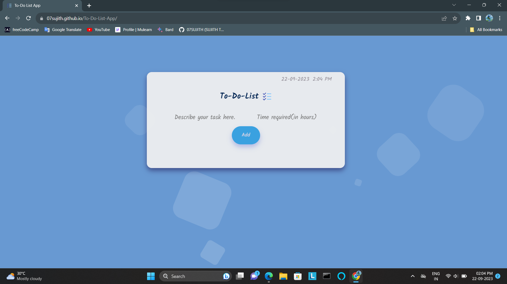

# To-Do List App
The "To-Do List App" is a digital tool designed to help individuals and teams organize their tasks, prioritize work, and enhance productivity. This app is suitable for anyone seeking an efficient way to manage their daily tasks and responsibilities.

## Demo
Check out the live demo of the To-Do List App [here](https://07sujith.github.io/To-Do-List-App/).

## Features

- Add new tasks with deadline
- Show pending tasks 
- Mark tasks as completed      
- Show completed tasks 
- Clear tasks 
- Store the task list in browser using local storage.

## Technologies Used

 - html
 - css
 - javascript

